# prekit-sdk

[](https://pypi.org/project/prekit-sdk/)
[](https://github.com/alpamayo-solutions/prekit-sdk/actions/workflows/ci.yml)
[](https://github.com/alpamayo-solutions/prekit-sdk/actions/workflows/ci.yml)
[](https://www.python.org/downloads/)
[](LICENSE)

User-friendly Python SDK for the PREKIT edge computing platform. Django-inspired API, self-documenting objects, pandas-native data access.

## Architecture

<figure>

<figcaption>How prekit-sdk wraps the auto-generated API client. The __getattr__ proxy in models.py is the critical boundary — new fields from client regeneration appear automatically.</figcaption>
</figure>

## Installation

```bash
# Install the API client wheel first (from GitHub Releases or local build)
pip install prekit_edge_node_api-1.10.0-py3-none-any.whl

# Install the SDK
pip install prekit-sdk

# Or from git
pip install git+https://github.com/alpamayo-solutions/prekit-sdk.git

# Or for local development
pip install -e "./prekit-sdk[dev]"
```

## CA Certificate

PREKIT deployments use a private PKI. The SDK can auto-download and cache the Alpamayo root CA certificate using `ca_cert="alpamayo"`:

```python
pk = Prekit.connect(url="https://edge.local", api_key="my-key", ca_cert="alpamayo")
```

The certificate is cached at `~/.prekit/alpamayo-root-ca.crt`. You can also pass an explicit path to any CA cert file:

```python
pk = Prekit.connect(url="https://edge.local", api_key="my-key", ca_cert="/path/to/ca.crt")
```

The root CA certificate is also available in this repo at [`certs/alpamayo-root-ca.crt`](certs/alpamayo-root-ca.crt).

```
SHA-256 Fingerprint: 62:96:51:A7:63:CC:14:B3:74:2A:BB:4B:A3:7A:17:20:5E:6D:58:9F:46:E9:CC:D8:E6:38:94:FE:3B:3C:7C:5C
Valid: 2025-04-30 to 2035-04-28
```

## Quick Start

```python
from prekit_sdk import Prekit

# Connect with API key (auto-downloads CA cert)
pk = Prekit.connect(url="https://edge.local", api_key="my-key", ca_cert="alpamayo")
print(pk)
# PREKIT SDK
#   URL:     https://edge.local
#   Health:  healthy
#   User:    operator@company.com
#   Roles:   reader

# Browse the asset tree
tree = pk.tree()
print(tree)
# Factory
# ├── LineA
# │   ├── CNC-Mill [3 signals]
# │   └── Lathe [2 signals]
# └── LineB
#     └── Press [1 signal]

# Find a machine
machine = pk.elements.get(name="CNC-Mill")
machine.help()

# Get its signals
sigs = machine.signals()

# Fetch historian data
df = machine.data(last="1h")
```

## Connection & Authentication

### Keycloak Client Credentials

For scripts and service accounts:

```python
pk = Prekit.connect(
    url="https://edge.local",
    client_id="prekit-test",
    client_secret="your-secret",
    verify_ssl=False,
)
```

### Azure / Entra ID

Interactive browser login with Microsoft account:

```python
pk = Prekit.connect(
    url="https://edge.local",
    auth="azure",
    tenant_id="your-tenant-id",
    client_id="your-app-id",
)
```

### API Key

```python
pk = Prekit.connect(url="https://edge.local", api_key="my-key")
```

### From Environment Variables

```python
pk = Prekit.connect_from_env()
```

Reads: `PREKIT_URL`, `PREKIT_AUTH_METHOD` (api_key/oauth/azure), `API_KEY`, `KEYCLOAK_URL`, `KEYCLOAK_CLIENT_ID`, `KEYCLOAK_CLIENT_SECRET`, `AZURE_TENANT_ID`, `AZURE_CLIENT_ID`, `PREKIT_VERIFY_SSL`, `CA_CERT_FILE`.

### Escape Hatch

Direct access to the raw `AutoRefreshApiClient`:

```python
pk.api  # for any API call not covered by the SDK
```

## Browsing the Asset Tree

```python
# Full tree (compact, with signal counts)
pk.tree().print()

# Full tree (expanded, showing individual signals)
pk.tree().print(signals=True)

# Subtree from a specific element
pk.tree(root=machine).print()
pk.tree(root="01JABCDE...").print()  # by ID
```

### Compact output

```
Factory
├── LineA
│   ├── CNC-Mill [3 signals]
│   └── Lathe [2 signals]
└── LineB
    └── Press [1 signal]
```

### Expanded output (signals=True)

```
Factory
├── LineA
│   ├── CNC-Mill
│   │   ├─ Temperature (float, C)
│   │   ├─ Vibration (float, mm/s)
│   │   └─ SpindleSpeed (int, rpm)
│   └── Lathe
│       └─ Temperature (float, C)
└── LineB
    └── Press
        └─ Pressure (float, bar)
```

## Finding Things (Django-style)

The SDK provides managers with `.get()`, `.filter()`, `.all()`, and `.create()`, inspired by Django's ORM.

### .get() -- single object

```python
# By name
machine = pk.elements.get(name="CNC-Mill")

# By ID (direct API call, fast)
sig = pk.signals.get(id="01JABCDE...")

# By hierarchy path
line = pk.elements.get(path="Factory/LineA")
```

### .filter() -- multiple objects

```python
# Substring match
machines = pk.elements.filter(name__contains="CNC")

# Multiple criteria
sigs = pk.signals.filter(data_type="float", unit="C")

# By parent element (accepts object or ID)
sigs = pk.signals.filter(system_element=machine)
```

### Available lookups

| Lookup | Example | Behavior |
|--------|---------|----------|
| `name` | `name="CNC"` | Exact match |
| `name__contains` | `name__contains="Mill"` | Substring |
| `name__startswith` | `name__startswith="CNC"` | Prefix |
| `name__icontains` | `name__icontains="mill"` | Case-insensitive substring |
| `system_element` | `system_element=machine` | FK (object or ID) |
| `id` | `id="01JAB..."` | Direct ID lookup |
| `path` | `path="Factory/LineA"` | Hierarchy path (elements only) |

### Handling non-unique signal names

Signal names are not unique. "Temperature" may exist on multiple machines:

```python
pk.signals.get(name="Temperature")
# -> MultipleObjectsReturned: 3 signals match name="Temperature"

# Disambiguate by scoping to an element:
sig = pk.signals.get(name="Temperature", system_element=machine)

# Or get all matches:
temps = pk.signals.filter(name="Temperature")
```

### .create()

```python
elem = pk.elements.create(name="NewMachine", parent=line_a)
sig = pk.signals.create(name="Temp", element=elem, data_type="float", unit="C")
```

## Data Access

All data access uses signal IDs internally (always unambiguous). Returns pandas DataFrames.

### Single signal

```python
sig = pk.signals.get(name="Temperature", system_element=machine)

df = sig.data(last="1h")                                    # relative time
df = sig.data(start="2026-03-17", end="2026-03-18")         # absolute range
latest = sig.latest()                                        # {"value": 23.5, "timestamp": ...}
```

### All signals on an element

```python
df = machine.data(last="1h")
# Pivoted DataFrame: timestamp | Temperature | Vibration | SpindleSpeed
```

### Multiple specific signals

```python
df = pk.data(signals=[sig1, sig2], last="1h")
```

## Rich Models & .help()

Every object returned by the SDK is a thin proxy over the generated Pydantic model. Generated fields are accessible directly; the SDK adds navigation methods.

```python
machine = pk.elements.get(name="CNC-Mill")

# Generated fields (from prekit_edge_node_api)
machine.name           # "CNC-Mill"
machine.id             # "01JABCDE..."
machine.created_at     # datetime

# SDK navigation methods
machine.signals()      # -> [<Signal: Temperature>, ...]
machine.children()     # -> []
machine.parent()       # -> <Element: LineA>
machine.path()         # -> "Factory/LineA/CNC-Mill"

# Escape hatch
machine._raw           # the generated SystemElement Pydantic model
```

### .help() -- self-documenting objects

```python
machine.help()
```

Output:

```
SystemElement: CNC-Mill (01JABCDE...)
Path: Factory/LineA/CNC-Mill

Fields (from generated model):
  name, id, created_at, updated_at, parent, level, ...

Relationships:
  .signals()              child signals (3 items)
  .children()             child elements (0 items)
  .parent()               parent element -> LineA

Actions:
  .data(last="1h")        DataFrame (all child signals)
  .tree()                 subtree from here
  .update(name=...)       patch this element
  ._raw                   generated SystemElement model
```

### Health check

```python
pk.is_healthy()   # -> True/False
pk.health()       # -> {"status": "healthy", ...}
```

## API Client Updates

The SDK is designed to be resilient to API client regeneration:

- **`__getattr__` proxy**: `element.name` delegates to `_raw.name`. New fields on the generated model appear automatically.
- **`.help()` introspects dynamically**: reads `model_fields` from the Pydantic model at runtime. New fields show up in help output without SDK changes.
- **Managers resolve API classes by name**: `getattr(prekit, "SystemElementApi")` at init time, not hardcoded imports.

**Update workflow**: regenerate the API client -> `pip install` the new wheel -> the SDK picks up new models and fields automatically. No SDK code changes needed unless adding new navigation methods.

## Development

```bash
# Setup
pip install tests/edge-node/api-client-whl/*.whl
pip install -e "./prekit-sdk[dev]"

# Run tests
pytest prekit-sdk/tests/ -v

# Lint
ruff check prekit-sdk/src/

# Demo notebook
jupyter notebook prekit-sdk/notebooks/demo.ipynb
```
